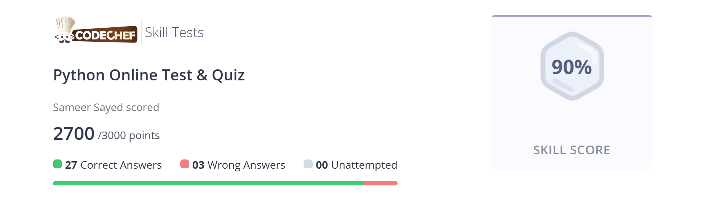

# 2025-02-10 - Revising Python Basics(py)
I revised the basics of Python. I learned about the variables, data types, and operators in Python. I attempted to solve some problems on Codechef and then I scored about 90% in the contest.



Also Learned about the functions in Python. Here's a quick Crashcourse on the Basics of Python: [Crashcourse on Python](https://www.youtube.com/watch?v=UrsmFxEIp5k)

# 2025-02-10 - Learned How to Write Markdowns(.md)
I learned how to write Markdowns(.md) by watching a youtube video. It was quite interesting and I learned a lot about the Markdowns.   
I found out that I can use the Markdowns to write the code in the HTML file. I also learned that Github's Markdown is a bit different from the regular Markdown.   
I made a **.md** file named ***test.md*** and I practiced in it . here's the link of my test.md file: [test.md]( ../Learning_Markdown/test.md) 

It would be better if you open it using realtime preview.  
Also, here's a quick Crashcourse on the Basics of Markdowns: [Crashcourse on Markdowns](https://www.youtube.com/watch?v=_PPWWRV6gbA&t=60s)

# 2025-02-11 - Learned NumPy(np)
I learned about NumPy. It is a library for the Python programming language, adding support for large, multi-dimensional arrays and matrices. It is used for scientific computing and data analysis. Highly used in Machine Learning and Deep Learning.  
 So ,at first I was a bit overwhelmed by the concepts. But then I started to understand the concepts. I practiced it in a VS Code notebook and gradually I started to understand the concepts.    
  Here is the link of the notebook: [NumPy Notebook](../Learning_NumPy/NumPy.ipynb) 

    
NumPy is interesting but once you understand the concepts, it is quite easy to use. It is highly efficient and fast as well.   
Here is a quick Crashcourse on NumPy: [Crashcourse on NumPy](https://www.youtube.com/watch?v=QUT1VHiLmmI)


# 2025-02-12 - Learned Pandas(pd)
Today I dove deep into Pandas, Python's premier data manipulation library. The journey was fascinating as I discovered how Pandas transforms the way we handle structured data in Python. Initially, the concepts seemed overwhelming, but as I progressed, everything started falling into place.

I learned about the fundamental data structures in Pandas:
- **DataFrame**: A 2-dimensional labeled data structure
- **Series**: A 1-dimensional labeled array
- **Index**: The powerful labeling system that makes Pandas so flexible

The practical sessions were particularly enlightening. I worked with:
- Data loading from various sources (CSV, Excel, JSON)
- Data cleaning and preprocessing techniques
- Advanced filtering and selection methods
- Group operations and aggregations
- Handling missing data professionally
- Merging and joining datasets
- Time series functionality

What impressed me most was Pandas' ability to handle real-world messy data. I practiced with a dataset about global temperature changes, which helped me understand how to:
1. Clean inconsistent date formats
2. Handle missing values appropriately
3. Perform complex aggregations
4. Create meaningful visualizations using Pandas with Matplotlib

Here is the link of my practice notebook: [Pandas Notebook](../Learning_Pandas/Pandas.ipynb)

The efficiency of Pandas in handling large datasets is remarkable. The vectorized operations make it significantly faster than traditional Python loops, and the intuitive API makes it a joy to work with.

Here's an excellent Crashcourse on Pandas that helped me grasp the concepts: [Crashcourse on Pandas](https://www.youtube.com/watch?v=vmEHCJofslg)

# 2025-02-13 - Learned Hugging Face(hf)
Today marked my introduction to Hugging Face, and it was an eye-opening experience in the world of Natural Language Processing (NLP). Hugging Face has revolutionized how we approach NLP tasks by making state-of-the-art models accessible to everyone.

Key areas I explored today:
1. **Transformers Library**:
   - Understanding the pipeline API
   - Working with tokenizers
   - Loading and using pre-trained models
   - Fine-tuning models on custom datasets

2. **Model Hub**:
   - Exploring available models
   - Understanding model cards
   - Downloading and using popular models like BERT, GPT-2, and RoBERTa
   - Contributing to the hub

3. **Practical Applications**:
   - Text classification
   - Named Entity Recognition (NER)
   - Question answering systems
   - Text generation and summarization
   - Sentiment analysis

I created several mini-projects to practice these concepts:
- A sentiment analysis tool for product reviews
- A text summarization system for news articles
- A simple chatbot using conversational models

The most fascinating part was how Hugging Face democratizes AI by making complex models accessible through simple APIs. I was able to implement advanced NLP features that would have taken months to develop from scratch.

Here is my detailed practice notebook: [Hugging Face Notebook](../Learning_HuggingFace/HuggingFace.ipynb)

The community aspect of Hugging Face is incredible - the Model Hub feels like a collaborative playground for AI enthusiasts. The documentation is comprehensive, and the community is always ready to help.

Here's the comprehensive guide that helped me get started: [Crashcourse on Hugging Face](https://www.youtube.com/watch?v=QEaBAZQCtwE)

# 2025-02-14 - Professional Folder/File Setup for Python Projects
Today I focused on learning professional project organization in Python, and it completely changed my perspective on code structure. I learned that a well-organized project is crucial for maintainability and collaboration.

Key concepts covered:

1. **Project Structure**:
   ```
   project_name/
   ├── docs/
   ├── src/
   │   └── project_name/
   │       ├── __init__.py
   │       ├── core.py
   │       └── helpers.py
   ├── tests/
   │   ├── __init__.py
   │   └── test_core.py
   ├── .gitignore
   ├── README.md
   ├── requirements.txt
   └── setup.py
   ```

2. **Virtual Environments**:
   - Understanding virtualenv and venv
   - Managing project dependencies
   - Creating and activating virtual environments
   - Best practices for dependency management

3. **Configuration Management**:
   - Using config files
   - Environment variables
   - Secrets management
   - Different configs for development/production

4. **Documentation**:
   - Writing effective READMEs
   - Code documentation standards
   - API documentation
   - Using tools like Sphinx

5. **Testing Setup**:
   - Unit tests structure
   - Integration tests
   - Test fixtures
   - Continuous Integration setup

I created a template project implementing all these concepts: [Project Structure Template](../Python_Project_Setup/template_project/)

The most valuable lesson was understanding how proper structure saves time in the long run and makes collaboration much smoother.

Here's the detailed guide I followed: [Guide to Python Project Structure](https://www.youtube.com/watch?v=WV1xKWy0iYY)

# 2025-02-15 - Comparison of the Libraries of Python
Today I created a comprehensive comparison of the Python libraries I've learned, focusing on their strengths, weaknesses, and optimal use cases. This exercise helped me understand when to use each library effectively.

**NumPy vs Pandas**:
1. **NumPy**:
   - Focused on numerical computations
   - Efficient array operations
   - Foundation for scientific computing
   - Best for mathematical operations
   
2. **Pandas**:
   - Specialized in data manipulation
   - Excellent for structured data
   - Built-in data analysis tools
   - Superior for handling missing data

**Data Science Workflow Integration**:
- NumPy for numerical computations
- Pandas for data preprocessing
- Matplotlib/Seaborn for visualization
- Scikit-learn for machine learning
- Hugging Face for NLP tasks

**Performance Considerations**:
- Memory usage patterns
- Computation speed comparisons
- Optimization techniques
- Best practices for each library

**Real-world Applications**:
- Data analysis projects
- Machine learning pipelines
- Scientific computing
- Financial analysis
- Natural language processing

I created detailed comparison notebooks with benchmarks and examples: [Python Libraries Comparison](../Python_Libraries/comparison.md)

This comparison helped me develop a framework for choosing the right tool for specific tasks.

Here's an excellent overview that supplements my findings: [Python Libraries Overview](https://www.youtube.com/watch?v=kqtD5dpn9C8)

# 2025-02-16 - Learned Matplotlib (plt)
Today I delved into Matplotlib, Python's most widely used data visualization library. The experience was incredibly enriching as I learned how to create professional-grade visualizations and understand the principles of effective data presentation.

Key concepts mastered:
1. **Basic Plotting**:
   - Line plots and scatter plots
   - Bar charts and histograms
   - Pie charts and box plots
   - Multiple subplots and figures

2. **Customization Features**:
   - Colors and styles
   - Labels and titles
   - Legends and annotations
   - Grid lines and axes modifications
   - Custom themes and stylesheets

3. **Advanced Techniques**:
   - 3D plotting
   - Animation and interactive plots
   - Twin axes and secondary y-axis
   - Custom projections
   - Error bars and fill between

I practiced creating various visualizations using real-world datasets, including:
- Time series analysis of stock prices
- Population distribution charts
- Scientific data visualization
- Statistical analysis plots
- Combined plots with Pandas DataFrames

The most fascinating aspect was learning how to layer different types of plots to create rich, informative visualizations that tell compelling data stories.

Here's my practice notebook with various examples: [Matplotlib Notebook](../Learning_Matplotlib/Matplotlib.ipynb)

What I found particularly valuable was understanding the object-oriented interface of Matplotlib, which offers much more control over plot elements compared to the pyplot interface.

For anyone starting with Matplotlib, here's an excellent tutorial that helped me: [Crashcourse on Matplotlib](https://www.youtube.com/watch?v=3Xc3CA655Y4)